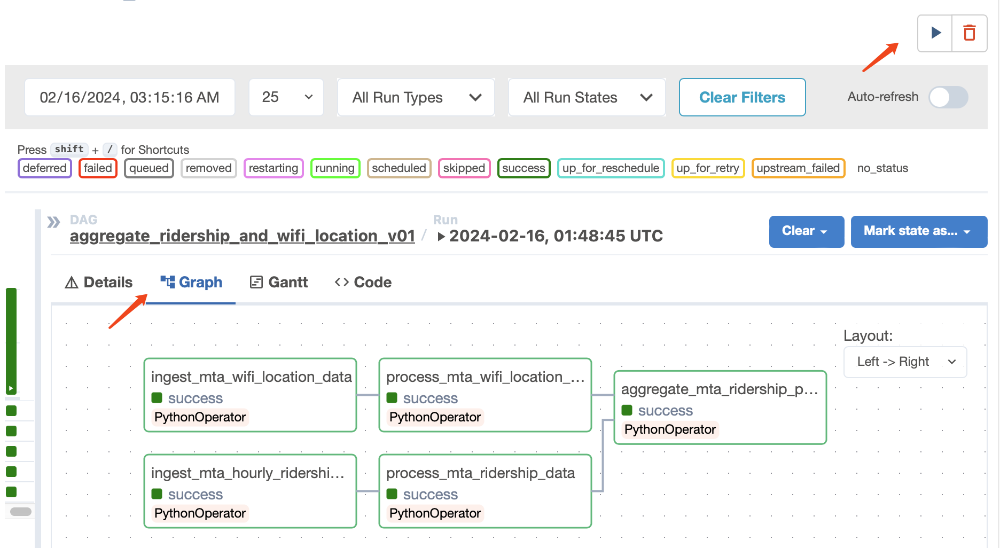

## MTA Data & Analytics Daily Ridership with Historical and Provider Information
___
### overview
This project is to build an ETL data pipeline to aggregate two open source datasets from MTA using **Apache Airflow**:
1. [MTA Subway Hourly Ridership](https://data.ny.gov/Transportation/MTA-Subway-Hourly-Ridership-Beginning-February-202/wujg-7c2s/about_data)
    
    This dataset provides subway ridership estimates on an hourly basis by subway station complex and class of fare payment.
&nbsp;
2. [MTA Wi-Fi Locations](https://data.ny.gov/Transportation/MTA-Wi-Fi-Locations/pwa9-tmie/about_data)

    Transit Wireless maintains location data where WIFI access is available. For each station(location), the availabilities of different providers and historical information are also provided.

The data pipeline is going to ingest the two datasets with REST API and store them as csv files in the file system directory in parallelism. Following the ingestion, there will be pre-processing tasks to prepare two datasets for aggregation. This extra step makes debugging easier. Finally, two dataset will be joined on their `station_complex` columns to output a daily total ridership dataset with `historical` and `provider available` info. 

To visualize the workflow:


### How to Navigate the Directory Structure
Core directory & file description:
- `dags`: The code as workflow/DAGs. 
- `dags/config/config.ini`: The externalized configuration for dags. The config file has the information for REST API url and data storage path... 
- `etl`: Where the core business logic resides. The detail logic of each task can be found here. the sub folder `etl/commons` includes utility scripts(eg. data insgestion & storage ) without detailed business logic.
- `data`: This directory contains all the dataset (raw data, intermediate data and aggregated data). The datasets are named with the format`{data_name}_{timestamp}.csv`
```
mta_data_ridership_aggregation
├───dags
│   │
│   ├───config
│   │   |───config.ini
|   |
│   └───mta_ridership_location_agg_dag.py
|
├───data
│   ├───aggregated
│   │   
│   ├───processed
|   |
│   ├───raw
│   │      servicenow_to_azure_blob_operator.py
│   │      postgres_templated_operator.py
│   |
│───etl
│   ├───commons
|   |   |───data_io.py
|   |          
│   ├───aggregate_to_daily_ridership_with_provider_historical_info.py
│   ├───process_mta_hourly_ridership.py
│   ├───process_mta_wif_location.py
|             
| logs
| plugins
| docker-compose.yaml
| Dockerfile
| README.md
| requirements.txt
```
### Tech Stacks & The Reasons
- Apache Airflow
    - Python is my go-to languge. And the fact that Airflow chose Python as an instrument to write DAGs, makes it easier for me to compose workflows.
    - It is one of the biggest open-souce project with lots of contributors and users. There are plenty of resouces for me to learn and get hands-on quickly, even though I am new to the tool.
    - The UI is user-friendly and easy to navigate.
- Docker
    - It encapsulates everything needed to run the project, including dependencies, libraries, and configuration files. This makes applications portable across different environments.
- Python Pandas & Numpy
    - Both Pandas and NumPy are widely used libraries in Python for data manipulation and analysis. Pandas provides easy-to-manipulate dataframe. And Numpy offers efficient computations.
### Set Up
1. Make sure you in the root directory of this project. Use `pwd` to locate your current directory
2. Install Docker if you don't have it([Docker Installation](https://docs.docker.com/engine/install/)). Use the docker version check to validate the installation.
```Bash
docker --version
docker compose version
```
3.  Run database migrations and create the first user account with Docker:
```Bash
docker compose up airflow-init
```
4. Now you can start all services in detached mode:
```Bash
docker compose up -d
```
5. To check if the containers are running:
```Bash
docker ps
```
6. Go to the Airflow interface [localhost:8080](localhost:8080)
7. log in with `username: airflow` and `password:airflow`
8. The data pipeline named `aggregate_ridership_and_wifi_location_v01` can be found on `DAGs`

9. The data pipeline can be trigger with the :arrow_forward: on the upper right. The Flow diagram can be found under the `Grapgh` tab. It demonstrates the step by step procedue and the dependencies among the tasks.

10. To stop and delete containers, delete volumes with database data and download images
```bash
docker compose down --volumes --rmi all
```
### Data Discovery

```python
# checking unique station_complex count on ridership data
print(mta_ridership["station_complex"].nunique())
```
`>>>142`
```python
# checking unique station_complex count on wifi location data
print(mta_wifi_location["station_complex"].nunique())
```
`>>>249`

```python
# Since the unique station_complex numbers vary
# checking if there is a subset relationship
print(set(mta_wifi_location["station_complex"]).issubset(mta_ridership["station_complex"]))
```
In this case, we should expect some ridership info from ridership will not have matching historical & provider_available info.
`>>>False`
```python
# Also checking the station_name column from wifi_location 
print(mta_wifi_location["station_name"].isna().sum())
print(mta_wifi_location["station_name"].nunique())
```
```
>>>1
>>>214
```

```python
# look into the duplicate station_name to see if they are under different station_complex
station_name_series = mta_wifi_location["station_name"]
print(mta_wifi_location[station_name_series.isin(station_name_series[station_name_series.duplicated()])].sort_values("station_name")[["station_name","station_complex"]])
```


```python
# look into the duplicate station_complex to see if they are with different station_name
station_complex_series = mta_wifi_location["station_complex"]
print(mta_wifi_location[station_complex_series.isin(station_complex_series[station_complex_series.duplicated()])].sort_values("station_complex")[["station_complex", "station_name","historical"]])
```


**Conclusion**: 
The relationship between `station_complex` and `station_name` is many to many.
Accroding to the assignment requirement, the aggregated data will demonstrate the total daily ridership breakdown by `transit_date`, `historical` and `provider_available` . `historical` and `provider_available` are station_location specific information. The raw dataset `MTA Subway Hourly Ridership` are based on `station_complex` instead of `station_name`.To aggregate two datasets, pre-process is needed so that the wifi location dataset can be station_complex unique. So the aggregation is based on two assumptions:

 - if any station location of a station_complex is historical, the station_complex will be deem historical
 - if any station location of a station_complex is provider available, the station_complex will be concluded as provider available

### Data Schema
In this project, the raw/aggregated datasets are stored in files system. 

- he raw datasets are stored at `data/raw`
- The aggregated datasets are stored at `data/aggregated`

This is the aggregated data schema:
|Column             |Datatype       |Description   |
| -------------     |:-------------:|:-----:|
| transit_date      | Date |The date payment took place in local time |
| station_complex   | Text      |The subway complex where an entry swipe or tap took place. |
|ridership          | Number       |Total number of riders that entered a subway complex via OMNY/MetroCard at the specific date and for any fare type.       |
| historical        | Boolean      |A flag as to whether the station complex or any part of the station complex has been deemed a historical artifact.|
| provider_available| Boolean    |Indicates whether any one of the providers(AT&T, T-Mobile, Sprint, Verison) is available at the station complex.     |

### How to access the dataset with SQL-like query
1. Using CLI tools
The most straight-forward method to access SQL-like query on the dataset. [csvkit](https://csvkit.readthedocs.io/en/latest/) and [csvq](https://mithrandie.github.io/csvq/) are two popular CLI tools. An example of using csvkit to query the output dataset will be :
```bash
csvsql --query "select station_complex from data where ridership > 100" data.csv > result.csv
```
2. If you prefer using Python & Jupyter notebook, pandasql will be a good option to access the csv with sql query.
```Python
from pandasql import sqldf
import pandas as pd

df = pd.read_csv(PATH_TO_CSV_FILE)
pysql = sqldf("SELECT * FROM df WHERE ridership > 100")
print(pysql)
```
### Future Workaround
- Storing the dataset on local directory is not the best practice. For better scalability, the datasets should be stored in cloud based oject storage(e.g. Amazon S3).
- Because this is a simple project with only few DAGs and tasks, also the code size is relatively small, so the tradiational dag file works well. Moving forward, **Taskflow API** should be used to reduce code size.
- Feel free to reach out to pcheng429@gmail.com if you have any questions.